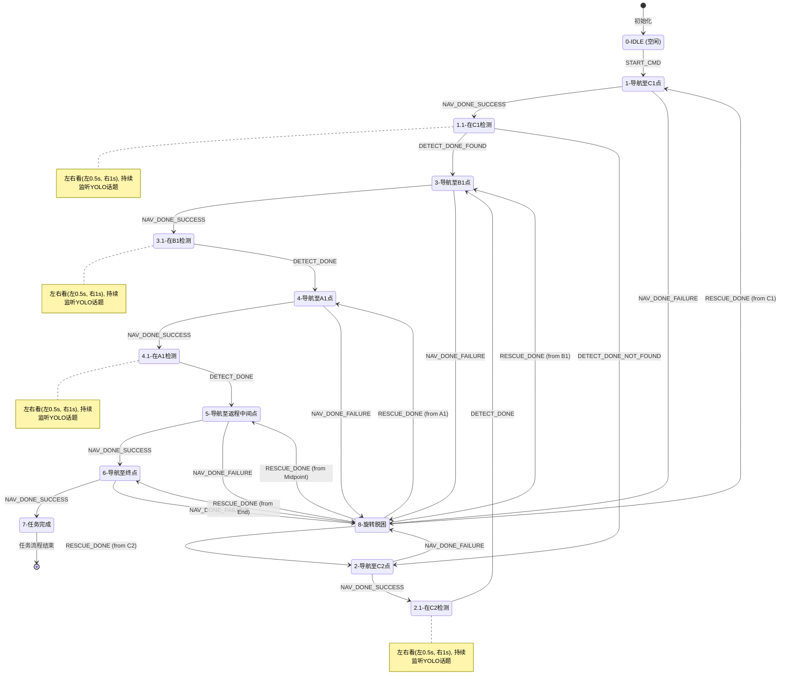

```mermaid
stateDiagram-v2
    %% 状态定义
    IDLE: 0-IDLE (空闲)
    NAV_TO_C1: 1-导航至C1点
    DETECT_AT_C1: 1.1-在C1检测
    NAV_TO_C2: 2-导航至C2点
    DETECT_AT_C2: 2.1-在C2检测
    NAV_TO_B1: 3-导航至B1点
    DETECT_AT_B1: 3.1-在B1检测
    NAV_TO_A1: 4-导航至A1点
    DETECT_AT_A1: 4.1-在A1检测
    NAV_TO_MIDPOINT: 5-导航至返程中间点
    NAV_TO_END: 6-导航至终点
    RESCUE_ROTATION: 8-旋转脱困
    COMPLETED: 7-任务完成

    %% 初始状态
    [*] --> IDLE: 初始化

    %% C区检测流程
    IDLE --> NAV_TO_C1: START_CMD
    NAV_TO_C1 --> DETECT_AT_C1: NAV_DONE_SUCCESS
    note right of DETECT_AT_C1: 左右看(左0.5s, 右1s), 持续监听YOLO话题
    DETECT_AT_C1 --> NAV_TO_B1: DETECT_DONE_FOUND
    DETECT_AT_C1 --> NAV_TO_C2: DETECT_DONE_NOT_FOUND
    
    NAV_TO_C2 --> DETECT_AT_C2: NAV_DONE_SUCCESS
    note right of DETECT_AT_C2: 左右看(左0.5s, 右1s), 持续监听YOLO话题
    DETECT_AT_C2 --> NAV_TO_B1: DETECT_DONE

    %% B区, A区, 及后续流程
    NAV_TO_B1 --> DETECT_AT_B1: NAV_DONE_SUCCESS
    note right of DETECT_AT_B1: 左右看(左0.5s, 右1s), 持续监听YOLO话题
    DETECT_AT_B1 --> NAV_TO_A1: DETECT_DONE
    NAV_TO_A1 --> DETECT_AT_A1: NAV_DONE_SUCCESS
    note right of DETECT_AT_A1: 左右看(左0.5s, 右1s), 持续监听YOLO话题
    DETECT_AT_A1 --> NAV_TO_MIDPOINT: DETECT_DONE
    NAV_TO_MIDPOINT --> NAV_TO_END: NAV_DONE_SUCCESS
    NAV_TO_END --> COMPLETED: NAV_DONE_SUCCESS

    %% 旋转脱困逻辑 (所有导航状态)
    NAV_TO_C1 --> RESCUE_ROTATION: NAV_DONE_FAILURE
    NAV_TO_C2 --> RESCUE_ROTATION: NAV_DONE_FAILURE
    NAV_TO_B1 --> RESCUE_ROTATION: NAV_DONE_FAILURE
    NAV_TO_A1 --> RESCUE_ROTATION: NAV_DONE_FAILURE
    NAV_TO_MIDPOINT --> RESCUE_ROTATION: NAV_DONE_FAILURE
    NAV_TO_END --> RESCUE_ROTATION: NAV_DONE_FAILURE

    %% 旋转后自动返回
    RESCUE_ROTATION --> NAV_TO_C1: RESCUE_DONE (from C1)
    RESCUE_ROTATION --> NAV_TO_C2: RESCUE_DONE (from C2)
    RESCUE_ROTATION --> NAV_TO_B1: RESCUE_DONE (from B1)
    RESCUE_ROTATION --> NAV_TO_A1: RESCUE_DONE (from A1)
    RESCUE_ROTATION --> NAV_TO_MIDPOINT: RESCUE_DONE (from Midpoint)
    RESCUE_ROTATION --> NAV_TO_END: RESCUE_DONE (from End)

    %% 最终状态
    COMPLETED --> [*]: 任务流程结束
```