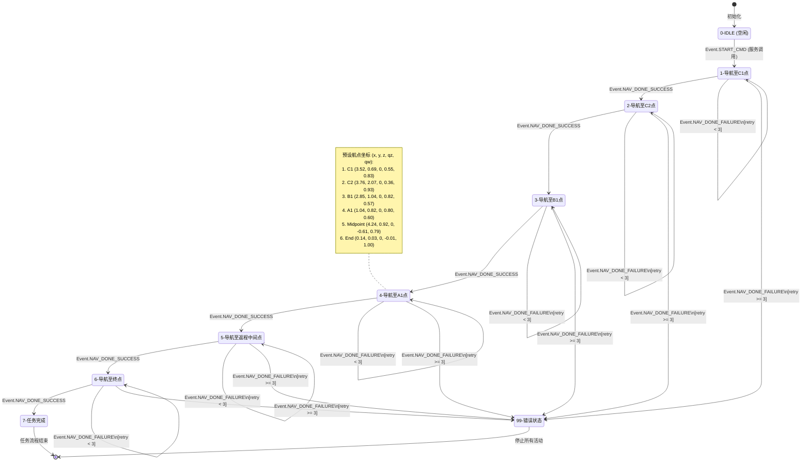

```mermaid
stateDiagram-v2
    %% 状态定义
    IDLE: 0-IDLE (空闲)
    NAV_TO_C1: 1-导航至C1点
    NAV_TO_C2: 2-导航至C2点
    NAV_TO_B1: 3-导航至B1点
    NAV_TO_A1: 4-导航至A1点
    NAV_TO_MIDPOINT: 5-导航至返程中间点
    NAV_TO_END: 6-导航至终点
    COMPLETED: 7-任务完成
    ERROR: 99-错误状态

    %% 初始状态
    [*] --> IDLE: 初始化

    %% 主要状态转换流程
    IDLE --> NAV_TO_C1: Event.START_CMD (服务调用)
    NAV_TO_C1 --> NAV_TO_C2: Event.NAV_DONE_SUCCESS
    NAV_TO_C2 --> NAV_TO_B1: Event.NAV_DONE_SUCCESS
    NAV_TO_B1 --> NAV_TO_A1: Event.NAV_DONE_SUCCESS
    NAV_TO_A1 --> NAV_TO_MIDPOINT: Event.NAV_DONE_SUCCESS
    NAV_TO_MIDPOINT --> NAV_TO_END: Event.NAV_DONE_SUCCESS
    NAV_TO_END --> COMPLETED: Event.NAV_DONE_SUCCESS

    %% 错误与重试处理
    NAV_TO_C1 --> NAV_TO_C1: Event.NAV_DONE_FAILURE\n[retry < 3]
    NAV_TO_C1 --> ERROR: Event.NAV_DONE_FAILURE\n[retry >= 3]

    NAV_TO_C2 --> NAV_TO_C2: Event.NAV_DONE_FAILURE\n[retry < 3]
    NAV_TO_C2 --> ERROR: Event.NAV_DONE_FAILURE\n[retry >= 3]

    NAV_TO_B1 --> NAV_TO_B1: Event.NAV_DONE_FAILURE\n[retry < 3]
    NAV_TO_B1 --> ERROR: Event.NAV_DONE_FAILURE\n[retry >= 3]

    NAV_TO_A1 --> NAV_TO_A1: Event.NAV_DONE_FAILURE\n[retry < 3]
    NAV_TO_A1 --> ERROR: Event.NAV_DONE_FAILURE\n[retry >= 3]

    NAV_TO_MIDPOINT --> NAV_TO_MIDPOINT: Event.NAV_DONE_FAILURE\n[retry < 3]
    NAV_TO_MIDPOINT --> ERROR: Event.NAV_DONE_FAILURE\n[retry >= 3]

    NAV_TO_END --> NAV_TO_END: Event.NAV_DONE_FAILURE\n[retry < 3]
    NAV_TO_END --> ERROR: Event.NAV_DONE_FAILURE\n[retry >= 3]

    %% 最终状态处理
    COMPLETED --> [*]: 任务流程结束
    ERROR --> [*]: 停止所有活动

    %% 航点坐标说明
    note left of NAV_TO_A1
        预设航点坐标 (x, y, z, qz, qw):
        1. C1 (3.52, 0.69, 0, 0.55, 0.83)
        2. C2 (3.76, 2.07, 0, 0.36, 0.93)
        3. B1 (2.85, 1.04, 0, 0.82, 0.57)
        4. A1 (1.04, 0.82, 0, 0.80, 0.60)
        5. Midpoint (4.24, 0.92, 0, -0.61, 0.79)
        6. End (0.14, 0.03, 0, -0.01, 1.00)
    end note
```