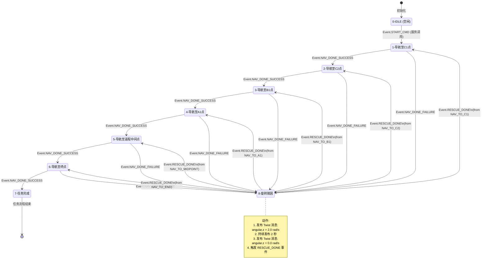

```mermaid
stateDiagram-v2
    %% 状态定义
    IDLE: 0-IDLE (空闲)
    NAV_TO_C1: 1-导航至C1点
    NAV_TO_C2: 2-导航至C2点
    NAV_TO_B1: 3-导航至B1点
    NAV_TO_A1: 4-导航至A1点
    NAV_TO_MIDPOINT: 5-导航至返程中间点
    NAV_TO_END: 6-导航至终点
    RESCUE_ROTATION: 8-旋转脱困
    COMPLETED: 7-任务完成

    %% 初始状态
    [*] --> IDLE: 初始化

    %% 主要状态转换流程
    IDLE --> NAV_TO_C1: Event.START_CMD (服务调用)
    NAV_TO_C1 --> NAV_TO_C2: Event.NAV_DONE_SUCCESS
    NAV_TO_C2 --> NAV_TO_B1: Event.NAV_DONE_SUCCESS
    NAV_TO_B1 --> NAV_TO_A1: Event.NAV_DONE_SUCCESS
    NAV_TO_A1 --> NAV_TO_MIDPOINT: Event.NAV_DONE_SUCCESS
    NAV_TO_MIDPOINT --> NAV_TO_END: Event.NAV_DONE_SUCCESS
    NAV_TO_END --> COMPLETED: Event.NAV_DONE_SUCCESS

    %% 旋转脱困逻辑
    NAV_TO_C1 --> RESCUE_ROTATION: Event.NAV_DONE_FAILURE
    NAV_TO_C2 --> RESCUE_ROTATION: Event.NAV_DONE_FAILURE
    NAV_TO_B1 --> RESCUE_ROTATION: Event.NAV_DONE_FAILURE
    NAV_TO_A1 --> RESCUE_ROTATION: Event.NAV_DONE_FAILURE
    NAV_TO_MIDPOINT --> RESCUE_ROTATION: Event.NAV_DONE_FAILURE
    NAV_TO_END --> RESCUE_ROTATION: Event.NAV_DONE_FAILURE
    
    %% 旋转后自动返回
    RESCUE_ROTATION --> NAV_TO_C1: Event.RESCUE_DONE\n(from NAV_TO_C1)
    RESCUE_ROTATION --> NAV_TO_C2: Event.RESCUE_DONE\n(from NAV_TO_C2)
    RESCUE_ROTATION --> NAV_TO_B1: Event.RESCUE_DONE\n(from NAV_TO_B1)
    RESCUE_ROTATION --> NAV_TO_A1: Event.RESCUE_DONE\n(from NAV_TO_A1)
    RESCUE_ROTATION --> NAV_TO_MIDPOINT: Event.RESCUE_DONE\n(from NAV_TO_MIDPOINT)
    RESCUE_ROTATION --> NAV_TO_END: Event.RESCUE_DONE\n(from NAV_TO_END)

    %% 最终状态
    COMPLETED --> [*]: 任务流程结束

    %% 动作说明
    note right of RESCUE_ROTATION
        动作:
        1. 发布 Twist 消息:
           angular.z = 2.0 rad/s
        2. 持续发布 2 秒
        3. 发布 Twist 消息:
           angular.z = 0.0 rad/s
        4. 触发 RESCUE_DONE 事件
    end note
```