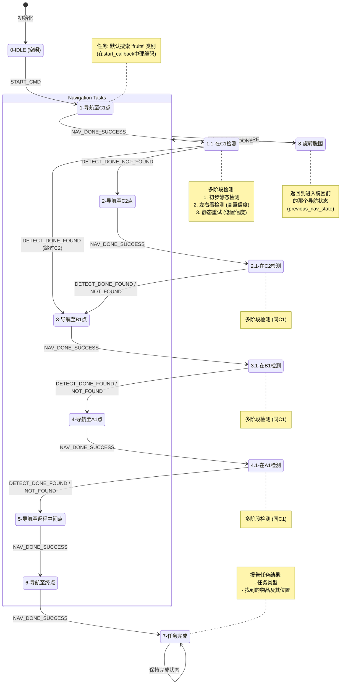

```mermaid
stateDiagram-v2
    %% 状态定义
    IDLE: 0-IDLE (空闲)
    NAV_TO_C1: 1-导航至C1点
    DETECT_AT_C1: 1.1-在C1检测
    NAV_TO_C2: 2-导航至C2点
    DETECT_AT_C2: 2.1-在C2检测
    NAV_TO_B1: 3-导航至B1点
    DETECT_AT_B1: 3.1-在B1检测
    NAV_TO_A1: 4-导航至A1点
    DETECT_AT_A1: 4.1-在A1检测
    NAV_TO_MIDPOINT: 5-导航至返程中间点
    NAV_TO_END: 6-导航至终点
    RESCUE_ROTATION: 8-旋转脱困
    COMPLETED: 7-任务完成

    %% 初始状态
    [*] --> IDLE: 初始化

    %% 任务启动
    IDLE --> NAV_TO_C1: START_CMD
    note left of NAV_TO_C1
      任务: 默认搜索 'fruits' 类别<br/>(在start_callback中硬编码)
    end note

    %% C区检测流程
    NAV_TO_C1 --> DETECT_AT_C1: NAV_DONE_SUCCESS
    note right of DETECT_AT_C1
      多阶段检测:<br/>1. 初步静态检测<br/>2. 左右看检测 (高置信度)<br/>3. 静态重试 (低置信度)
    end note
    DETECT_AT_C1 --> NAV_TO_B1: DETECT_DONE_FOUND (跳过C2)
    DETECT_AT_C1 --> NAV_TO_C2: DETECT_DONE_NOT_FOUND

    NAV_TO_C2 --> DETECT_AT_C2: NAV_DONE_SUCCESS
    note right of DETECT_AT_C2
      多阶段检测 (同C1)
    end note
    DETECT_AT_C2 --> NAV_TO_B1: DETECT_DONE_FOUND / NOT_FOUND

    %% B区, A区, 及后续流程
    NAV_TO_B1 --> DETECT_AT_B1: NAV_DONE_SUCCESS
    note right of DETECT_AT_B1
      多阶段检测 (同C1)
    end note
    DETECT_AT_B1 --> NAV_TO_A1: DETECT_DONE_FOUND / NOT_FOUND

    NAV_TO_A1 --> DETECT_AT_A1: NAV_DONE_SUCCESS
    note right of DETECT_AT_A1
      多阶段检测 (同C1)
    end note
    DETECT_AT_A1 --> NAV_TO_MIDPOINT: DETECT_DONE_FOUND / NOT_FOUND

    NAV_TO_MIDPOINT --> NAV_TO_END: NAV_DONE_SUCCESS
    NAV_TO_END --> COMPLETED: NAV_DONE_SUCCESS

    %% 旋转脱困逻辑 (适用于所有导航状态)
    state "Navigation Tasks" as NavTasks {
        NAV_TO_C1
        NAV_TO_C2
        NAV_TO_B1
        NAV_TO_A1
        NAV_TO_MIDPOINT
        NAV_TO_END
    }
    NavTasks --> RESCUE_ROTATION: NAV_DONE_FAILURE

    %% 旋转后自动返回
    RESCUE_ROTATION --> NavTasks: RESCUE_DONE
    note right of RESCUE_ROTATION
      返回到进入脱困前
      的那个导航状态
      (previous_nav_state)
    end note

    %% 最终状态
    note left of COMPLETED
      报告任务结果:
      - 任务类型
      - 找到的物品及其位置
    end note
    COMPLETED --> COMPLETED: 保持完成状态
```