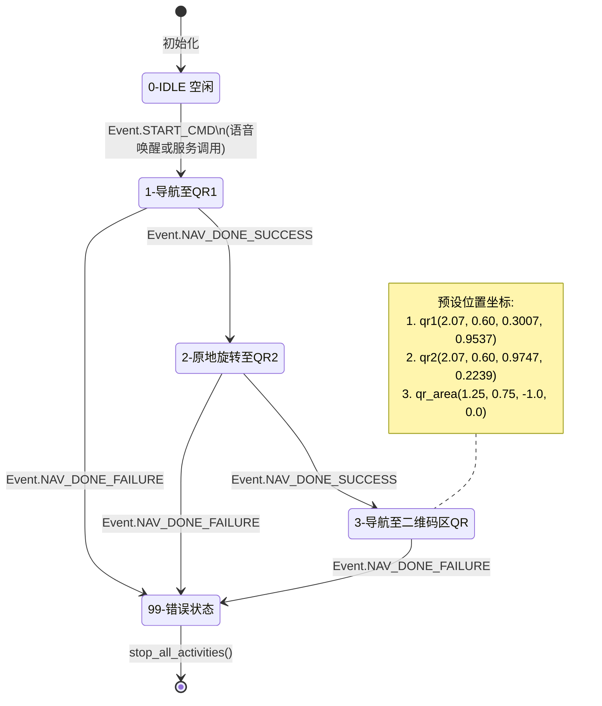

```mermaid
stateDiagram-v2
    %% 状态定义
    IDLE: 0-IDLE 空闲
    NAVIGATE_TO_QR1: 1-导航至QR1
    ROTATE_TO_QR2: 2-原地旋转至QR2
    NAVIGATE_TO_QR_AREA: 3-导航至二维码区QR
    ERROR: 99-错误状态
    
    %% 定义初始状态
    [*] --> IDLE: 初始化
    
    %% 主要状态转换流程
    IDLE --> NAVIGATE_TO_QR1: Event.START_CMD\n(语音唤醒或服务调用)
    NAVIGATE_TO_QR1 --> ROTATE_TO_QR2: Event.NAV_DONE_SUCCESS
    ROTATE_TO_QR2 --> NAVIGATE_TO_QR_AREA: Event.NAV_DONE_SUCCESS
    
    %% 错误处理转换
    NAVIGATE_TO_QR1 --> ERROR: Event.NAV_DONE_FAILURE
    ROTATE_TO_QR2 --> ERROR: Event.NAV_DONE_FAILURE
    NAVIGATE_TO_QR_AREA --> ERROR: Event.NAV_DONE_FAILURE
    
    
    %% 错误状态处理
    ERROR --> [*]: stop_all_activities()
    

    %% 位置说明
    note left of NAVIGATE_TO_QR_AREA
        预设位置坐标:
        1. qr1(2.07, 0.60, 0.3007, 0.9537)
        2. qr2(2.07, 0.60, 0.9747, 0.2239)
        3. qr_area(1.25, 0.75, -1.0, 0.0)
    end note
```