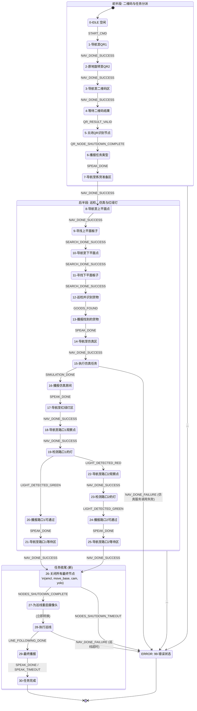

```mermaid
stateDiagram-v2
    %% @title 状态机融合 C 版本
    %% @author Gemini (根据 全程状态机_融合后_C.py 逻辑生成)
    %% @description C版本特点: 保留了 SHUTDOWN_YOLO_NODE 的状态名, 但扩展了其功能, 并添加了新的收尾状态。

    %% --- 状态定义 ---
    state "前半段: 二维码与任务分派" as Phase1 {
        direction LR
        [*] --> IDLE
        IDLE: 0-IDLE 空闲
        NAVIGATE_TO_QR1: 1-导航至QR1
        ROTATE_TO_QR2: 2-原地旋转至QR2
        NAVIGATE_TO_QR_AREA: 3-导航至二维码区
        WAIT_FOR_QR_RESULT: 4-等待二维码结果
        SHUTDOWN_QR_NODE: 5-关闭QR识别节点
        SPEAK_TASK_TYPE: 6-播报任务类型
        NAV_TO_PICK_PREP_AREA: 7-导航至拣货准备区
        
        IDLE --> NAVIGATE_TO_QR1: START_CMD
        NAVIGATE_TO_QR1 --> ROTATE_TO_QR2: NAV_DONE_SUCCESS
        ROTATE_TO_QR2 --> NAVIGATE_TO_QR_AREA: NAV_DONE_SUCCESS
        NAVIGATE_TO_QR_AREA --> WAIT_FOR_QR_RESULT: NAV_DONE_SUCCESS
        WAIT_FOR_QR_RESULT --> SHUTDOWN_QR_NODE: QR_RESULT_VALID
        SHUTDOWN_QR_NODE --> SPEAK_TASK_TYPE: QR_NODE_SHUTDOWN_COMPLETE
        SPEAK_TASK_TYPE --> NAV_TO_PICK_PREP_AREA: SPEAK_DONE
    }

    state "后半段: 巡检、仿真与红绿灯" as Phase2 {
        direction LR
        NAVIGATE_TO_UP_POINT: 8-导航至上平面点
        SEARCH_UP_BOARD: 9-寻找上平面板子
        NAVIGATE_TO_DOWN_POINT: 10-导航至下平面点
        SEARCH_DOWN_BOARD: 11-寻找下平面板子
        PICK_UP_GOODS: 12-巡检并识别货物
        SPEAK_GOODS: 13-播报找到的货物
        NAV_TO_SIMULATION: 14-导航至仿真区
        DO_SIMULATION_TASKS: 15-执行仿真任务
        SPEAK_ROOM: 16-播报仿真房间
        NAV_TO_TRAFFIC: 17-导航至红绿灯区
        NAV_TO_LANE1_OBSERVE_POINT: 18-导航至路口1观察点
        DETECTING_LANE1_LIGHT: 19-检测路口1的灯
        SPEAK_LANE1_CLEAR: 20-播报路口1可通过
        NAV_TO_LANE1_WAITING_POINT: 21-导航至路口1等待区
        NAV_TO_LANE2_OBSERVE_POINT: 22-导航至路口2观察点
        DETECTING_LANE2_LIGHT: 23-检测路口2的灯
        SPEAK_LANE2_CLEAR: 24-播报路口2可通过
        NAV_TO_LANE2_WAITING_POINT: 25-导航至路口2等待区

        NAVIGATE_TO_UP_POINT --> SEARCH_UP_BOARD: NAV_DONE_SUCCESS
        SEARCH_UP_BOARD --> NAVIGATE_TO_DOWN_POINT: SEARCH_DONE_SUCCESS
        NAVIGATE_TO_DOWN_POINT --> SEARCH_DOWN_BOARD: SEARCH_DONE_SUCCESS
        SEARCH_DOWN_BOARD --> PICK_UP_GOODS: SEARCH_DONE_SUCCESS
        PICK_UP_GOODS --> SPEAK_GOODS: GOODS_FOUND
        SPEAK_GOODS --> NAV_TO_SIMULATION: SPEAK_DONE
        NAV_TO_SIMULATION --> DO_SIMULATION_TASKS: NAV_DONE_SUCCESS
        DO_SIMULATION_TASKS --> SPEAK_ROOM: SIMULATION_DONE
        SPEAK_ROOM --> NAV_TO_TRAFFIC: SPEAK_DONE
        NAV_TO_TRAFFIC --> NAV_TO_LANE1_OBSERVE_POINT: NAV_DONE_SUCCESS
        NAV_TO_LANE1_OBSERVE_POINT --> DETECTING_LANE1_LIGHT: NAV_DONE_SUCCESS
        DETECTING_LANE1_LIGHT --> SPEAK_LANE1_CLEAR: LIGHT_DETECTED_GREEN
        DETECTING_LANE1_LIGHT --> NAV_TO_LANE2_OBSERVE_POINT: LIGHT_DETECTED_RED
        SPEAK_LANE1_CLEAR --> NAV_TO_LANE1_WAITING_POINT: SPEAK_DONE
        NAV_TO_LANE2_OBSERVE_POINT --> DETECTING_LANE2_LIGHT: NAV_DONE_SUCCESS
        DETECTING_LANE2_LIGHT --> SPEAK_LANE2_CLEAR: LIGHT_DETECTED_GREEN
        SPEAK_LANE2_CLEAR --> NAV_TO_LANE2_WAITING_POINT: SPEAK_DONE
    }

    state "任务收尾 (新)" as Phase3 {
        direction LR
        SHUTDOWN_YOLO_NODE: 26-关闭所有最终节点\n(amcl, move_base, cam, yolo)
        RELAUNCH_CAMERA_FOR_LINE_FOLLOWING: 27-为巡线重启摄像头
        LINE_FOLLOWING: 28-执行巡线
        SPEAK_FINAL: 29-最终播报
        TASK_COMPLETE: 30-任务完成

        SHUTDOWN_YOLO_NODE --> RELAUNCH_CAMERA_FOR_LINE_FOLLOWING: NODES_SHUTDOWN_COMPLETE
        RELAUNCH_CAMERA_FOR_LINE_FOLLOWING --> LINE_FOLLOWING: (立即转换)
        LINE_FOLLOWING --> SPEAK_FINAL: LINE_FOLLOWING_DONE
        SPEAK_FINAL --> TASK_COMPLETE: SPEAK_DONE / SPEAK_TIMEOUT
    }

    %% --- 状态衔接的关键桥梁 ---
    NAV_TO_PICK_PREP_AREA --> NAVIGATE_TO_UP_POINT: NAV_DONE_SUCCESS
    NAV_TO_LANE1_WAITING_POINT --> SHUTDOWN_YOLO_NODE: NAV_DONE_SUCCESS
    NAV_TO_LANE2_WAITING_POINT --> SHUTDOWN_YOLO_NODE: NAV_DONE_SUCCESS

    %% --- 统一的错误处理流程 ---
    state "ERROR: 99-错误状态" as ERROR
    Phase1 --> ERROR: ...
    Phase2 --> ERROR: ...
    DO_SIMULATION_TASKS --> ERROR: NAV_DONE_FAILURE (仿真服务调用失败)
    SHUTDOWN_YOLO_NODE --> ERROR: NODES_SHUTDOWN_TIMEOUT
    LINE_FOLLOWING --> ERROR: NAV_DONE_FAILURE (巡线超时)

    %% --- 流程终点 ---
    TASK_COMPLETE --> [*]
    ERROR --> [*]
```