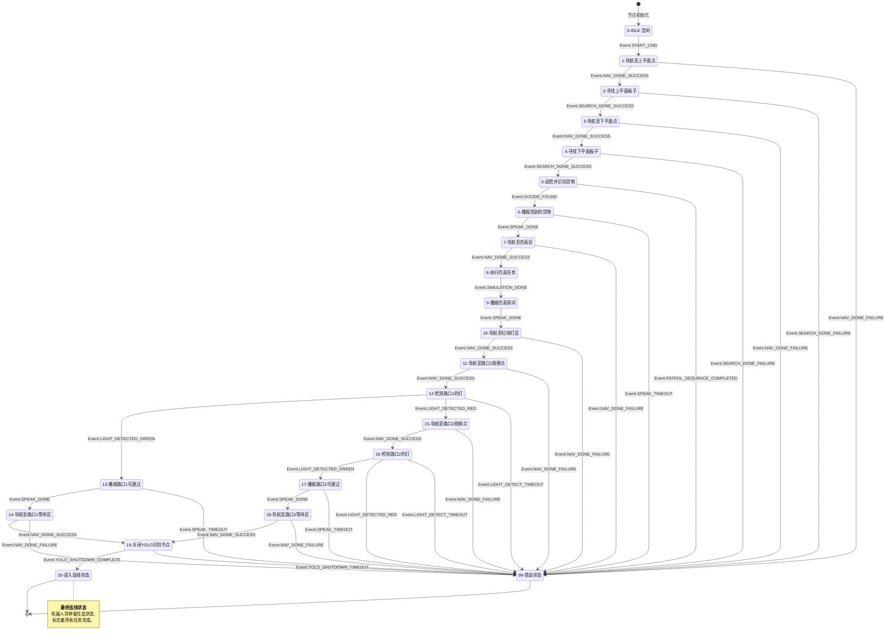

```mermaid
stateDiagram-v2
    %% 模式: 创新
    %% AI模型: Gemini
    %% 目的: 展示包含关闭YOLO节点及进入巡线状态的扩展状态机

    %% --- 基础任务状态 (无变化) ---
    IDLE: 0-IDLE 空闲
    NAVIGATE_TO_UP_POINT: 1-导航至上平面点
    SEARCH_UP_BOARD: 2-寻找上平面板子
    NAVIGATE_TO_DOWN_POINT: 3-导航至下平面点
    SEARCH_DOWN_BOARD: 4-寻找下平面板子
    PICK_UP_GOODS: 5-巡检并识别货物
    SPEAK_GOODS: 6-播报找到的货物
    NAV_TO_SIMULATION: 7-导航至仿真区
    DO_SIMULATION_TASKS: 8-执行仿真任务
    SPEAK_ROOM: 9-播报仿真房间
    NAV_TO_TRAFFIC: 10-导航至红绿灯区
    
    %% --- 红绿灯处理状态 (无变化) ---
    NAV_TO_LANE1_OBSERVE_POINT: 11-导航至路口1观察点
    DETECTING_LANE1_LIGHT: 12-检测路口1的灯
    SPEAK_LANE1_CLEAR: 13-播报路口1可通过
    NAV_TO_LANE1_WAITING_POINT: 14-导航至路口1等待区
    NAV_TO_LANE2_OBSERVE_POINT: 15-导航至路口2观察点
    DETECTING_LANE2_LIGHT: 16-检测路口2的灯
    SPEAK_LANE2_CLEAR: 17-播报路口2可通过
    NAV_TO_LANE2_WAITING_POINT: 18-导航至路口2等待区

    %% --- 新增: 任务收尾状态 ---
    SHUTDOWN_YOLO_NODE: 19-关闭YOLO识别节点
    LINE_FOLLOWING: 20-进入巡线状态

    ERROR: 99-错误状态

    %% --- 流程开始 ---
    [*] --> IDLE: 节点初始化

    %% --- 主要任务流程 (无变化) ---
    IDLE --> NAVIGATE_TO_UP_POINT: Event.START_CMD
    NAVIGATE_TO_UP_POINT --> SEARCH_UP_BOARD: Event.NAV_DONE_SUCCESS
    NAVIGATE_TO_UP_POINT --> ERROR: Event.NAV_DONE_FAILURE
    SEARCH_UP_BOARD --> NAVIGATE_TO_DOWN_POINT: Event.SEARCH_DONE_SUCCESS
    SEARCH_UP_BOARD --> ERROR: Event.SEARCH_DONE_FAILURE
    NAVIGATE_TO_DOWN_POINT --> SEARCH_DOWN_BOARD: Event.NAV_DONE_SUCCESS
    NAVIGATE_TO_DOWN_POINT --> ERROR: Event.NAV_DONE_FAILURE
    SEARCH_DOWN_BOARD --> PICK_UP_GOODS: Event.SEARCH_DONE_SUCCESS
    SEARCH_DOWN_BOARD --> ERROR: Event.SEARCH_DONE_FAILURE
    PICK_UP_GOODS --> SPEAK_GOODS: Event.GOODS_FOUND
    PICK_UP_GOODS --> ERROR: Event.PATROL_SEQUENCE_COMPLETED
    SPEAK_GOODS --> NAV_TO_SIMULATION: Event.SPEAK_DONE
    SPEAK_GOODS --> ERROR: Event.SPEAK_TIMEOUT
    NAV_TO_SIMULATION --> DO_SIMULATION_TASKS: Event.NAV_DONE_SUCCESS
    NAV_TO_SIMULATION --> ERROR: Event.NAV_DONE_FAILURE
    DO_SIMULATION_TASKS --> SPEAK_ROOM: Event.SIMULATION_DONE
    SPEAK_ROOM --> NAV_TO_TRAFFIC: Event.SPEAK_DONE

    %% --- 红绿灯处理流程 (修改终点) ---
    NAV_TO_TRAFFIC --> NAV_TO_LANE1_OBSERVE_POINT: Event.NAV_DONE_SUCCESS
    NAV_TO_TRAFFIC --> ERROR: Event.NAV_DONE_FAILURE

    NAV_TO_LANE1_OBSERVE_POINT --> DETECTING_LANE1_LIGHT: Event.NAV_DONE_SUCCESS
    NAV_TO_LANE1_OBSERVE_POINT --> ERROR: Event.NAV_DONE_FAILURE

    DETECTING_LANE1_LIGHT --> SPEAK_LANE1_CLEAR: Event.LIGHT_DETECTED_GREEN
    DETECTING_LANE1_LIGHT --> NAV_TO_LANE2_OBSERVE_POINT: Event.LIGHT_DETECTED_RED
    DETECTING_LANE1_LIGHT --> ERROR: Event.LIGHT_DETECT_TIMEOUT

    SPEAK_LANE1_CLEAR --> NAV_TO_LANE1_WAITING_POINT: Event.SPEAK_DONE
    SPEAK_LANE1_CLEAR --> ERROR: Event.SPEAK_TIMEOUT

    NAV_TO_LANE2_OBSERVE_POINT --> DETECTING_LANE2_LIGHT: Event.NAV_DONE_SUCCESS
    NAV_TO_LANE2_OBSERVE_POINT --> ERROR: Event.NAV_DONE_FAILURE

    DETECTING_LANE2_LIGHT --> SPEAK_LANE2_CLEAR: Event.LIGHT_DETECTED_GREEN
    DETECTING_LANE2_LIGHT --> ERROR: Event.LIGHT_DETECTED_RED
    DETECTING_LANE2_LIGHT --> ERROR: Event.LIGHT_DETECT_TIMEOUT

    SPEAK_LANE2_CLEAR --> NAV_TO_LANE2_WAITING_POINT: Event.SPEAK_DONE
    SPEAK_LANE2_CLEAR --> ERROR: Event.SPEAK_TIMEOUT

    %% --- 修改: 抵达等待区后，不再停留，而是关闭YOLO节点 ---
    NAV_TO_LANE1_WAITING_POINT --> SHUTDOWN_YOLO_NODE: Event.NAV_DONE_SUCCESS
    NAV_TO_LANE1_WAITING_POINT --> ERROR: Event.NAV_DONE_FAILURE

    NAV_TO_LANE2_WAITING_POINT --> SHUTDOWN_YOLO_NODE: Event.NAV_DONE_SUCCESS
    NAV_TO_LANE2_WAITING_POINT --> ERROR: Event.NAV_DONE_FAILURE

    %% --- 新增: YOLO节点关闭流程 ---
    SHUTDOWN_YOLO_NODE --> LINE_FOLLOWING: Event.YOLO_SHUTDOWN_COMPLETE
    SHUTDOWN_YOLO_NODE --> ERROR: Event.YOLO_SHUTDOWN_TIMEOUT

    %% --- 流程终点 ---
    ERROR --> [*]
    LINE_FOLLOWING --> [*]
    note right of LINE_FOLLOWING
        **最终巡线状态**
        机器人将停留在此状态,
        标志着所有任务完成。
    end note
```